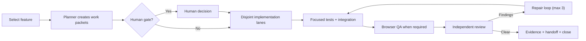

# LoreCanvas Multi-Agent Development System

This document is the human-readable operating model for the repository. The
machine-readable contract is `agent_harness.json`; the current run state is
`agent_work/current.json`.

## Objective

Keep product decisions centralized while parallelizing bounded engineering work.
The system optimizes for short context, explicit ownership, repeatable
verification, and independent review.

The unit of product planning remains one `feature_list.json` node. A feature can
contain multiple work packets, but only one feature is active at a time. This
prevents two features from silently changing the same domain model while still
allowing engine, tests, web UI, and QA to progress concurrently.

## Operating model



The main agent is the orchestrator and final integrator. Subagents do bounded
work and return compact results. Raw logs should remain in their threads unless
needed as evidence.

## Roles

| Role | Primary output | Writes |
| --- | --- | --- |
| Planner | acceptance contract, work packets, risks, human gates | no product files |
| Engine worker | pure model/state/serialization changes | assigned engine/state files |
| Web worker | React/PixiJS UI and interactions | assigned UI/style/state files |
| Test worker | focused tests and regression coverage | assigned test files |
| Browser QA | rendered-flow evidence and defects | no source files |
| Reviewer | correctness, architecture, product-boundary findings | no source files |

Custom agent definitions live in `.codex/agents/`. The reusable orchestration
workflow lives in `.agents/skills/lorecanvas-feature-loop/`.

## Work packets

Every active run records work packets in `agent_work/current.json`. Each packet
must state:

- a stable id and owner role;
- expected behavior and acceptance assertions;
- exact write set;
- dependencies on other packets;
- focused verification command;
- whether browser evidence or a human decision is required.

Parallel writes are allowed only when write sets are disjoint. The following
files are integration bottlenecks and have one writer at a time:

- `src/state/boardStore.ts`
- `src/state/scenarioStore.ts`
- `src/ui/App.tsx`
- `src/ui/BoardCanvas.tsx`
- `src/styles.css`
- `feature_list.json`
- `progress.md`
- `agent_work/current.json`

When a feature requires several changes in one bottleneck file, assign them to
one worker or let the orchestrator integrate sequentially.

## Loop state

`agent_work/current.json` uses these states:

- `idle`: no active feature.
- `planning`: acceptance and packets are being prepared.
- `awaiting_human`: a domain, visual, or external decision is pending.
- `ready`: approved plan with non-overlapping ownership.
- `implementing`: workers are changing assigned files.
- `verifying`: focused and full checks are running.
- `reviewing`: independent review is active.
- `repairing`: a bounded correction pass is active.
- `blocked`: progress requires unavailable input or external state.
- `completed`: evidence is complete and the feature can be closed.

The repair loop is capped at three iterations. After three failures with the same
root cause, stop and report the blocker instead of silently looping.

`scripts/agent-run.mjs` serializes state mutations with
`agent_work/.mutation.lock`. Feature claim/release writes use a small recovery
journal so an interrupted two-file update can be completed by the next
mutating command. Do not edit the lock or transaction files while an
orchestrator is active.

## Tool and surface routing

- Use subagents for read-heavy exploration, tests, log analysis, and disjoint
  implementation packets.
- Use project worktrees for independent background write tasks. Same-checkout
  agents are safer for read-only work.
- Use the in-app Browser for local web UI testing. Enable Developer mode when
  console, network, DOM/style inspection, or performance tracing is material.
- Use Computer Use for Windows-native flows or UI surfaces the in-app Browser
  cannot exercise. On Windows it uses the foreground desktop.
- Use plugins or MCP connectors for structured external systems before visual
  automation.
- Use hooks only for deterministic repository checks. Project hooks require
  explicit trust and are not a substitute for product reasoning.
- Use automations only after the prompt has been tested manually. Prefer
  worktree automations for anything that may write files.

## Repeated-work improvement loop

Record recurring friction in `docs/skill-candidates.md`. The
`$lorecanvas-pattern-miner` skill promotes a candidate only when:

1. the behavior occurred at least three times;
2. inputs, outputs, and success criteria are stable;
3. the workflow is safe to replay;
4. a skill is a better fit than an `AGENTS.md` rule, deterministic script, hook,
   or one-off prompt.

Record & Replay is currently a macOS-only product surface and its initial
availability excludes the EEA, UK, and Switzerland. This Windows repository
therefore uses repository skills plus a recurring pattern-mining automation
instead of assuming Record & Replay is available.

## Human workflow

Humans normally interact at four points:

1. Change product priority or acceptance in `feature_list.json`.
2. Resolve a gate documented in `docs/human-gates.md`.
3. Review browser screenshots or visual alternatives.
4. Explicitly authorize commit, push, PR, deployment, or other external changes.

For routine engineering work, start a thread with:

```text
Use $lorecanvas-feature-loop to continue the next dependency-ready feature.
Use subagents and stop only for documented human gates or a real blocker.
```

For rendered verification:

```text
Use $lorecanvas-browser-qa to verify the changed flow and return evidence.
```

For workflow improvement:

```text
Use $lorecanvas-pattern-miner to inspect recent progress and propose one skill candidate.
```

The Codex app automation `lorecanvas-pattern-miner` runs this review in an
isolated worktree every Monday at 09:00 Europe/Stockholm. It may update only the
candidate log or one validated repository skill; it must not modify product
code, `feature_list.json`, or `progress.md`.

## Codex feature status

The design is based on current public Codex behavior as of June 20, 2026:

- subagents are available in the Codex app and CLI and require explicit
  delegation;
- project custom agents use `.codex/agents/*.toml`;
- repository skills use `.agents/skills/`;
- automations can run in local checkouts or worktrees;
- Browser Developer mode provides approved full CDP access;
- Computer Use is available on supported Windows installations, but in-app
  Browser remains the preferred surface for local web apps;
- hooks support command handlers, while prompt/agent handlers are parsed but not
  executed.

Do not encode undocumented product flags or assume a capability is installed
just because this repository describes it.

The repository includes a `Stop` hook in `.codex/hooks.json` that runs only the
read-only harness validation. Codex will require a human to review and trust the
hook definition before it runs. The hook intentionally does not install
dependencies, run a dev server, or modify source files.
